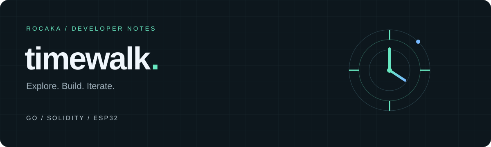
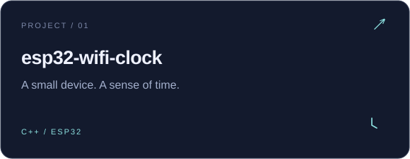
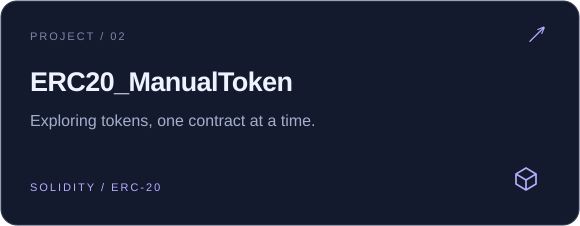
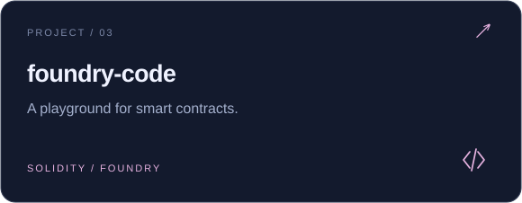
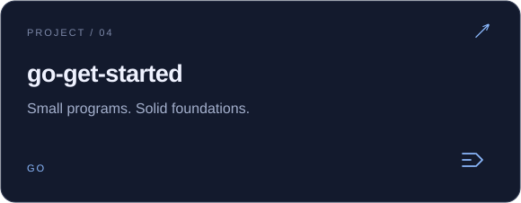

  

  <b>你好，我是 timewalk。</b> 
  从 Go 到智能合约，再到 ESP32，记录每一次把想法变成代码的过程。

  <a href="https://github.com/rocaka?tab=repositories">Explore my repositories ↗</a>
  &nbsp; · &nbsp;
  <a href="https://github.com/rocaka?tab=stars">Things I find interesting ↗</a>

 

### Selected work &nbsp; / &nbsp; 项目与实验

 

 
 

✦ &nbsp; STAY CURIOUS. KEEP BUILDING. &nbsp; ✦

