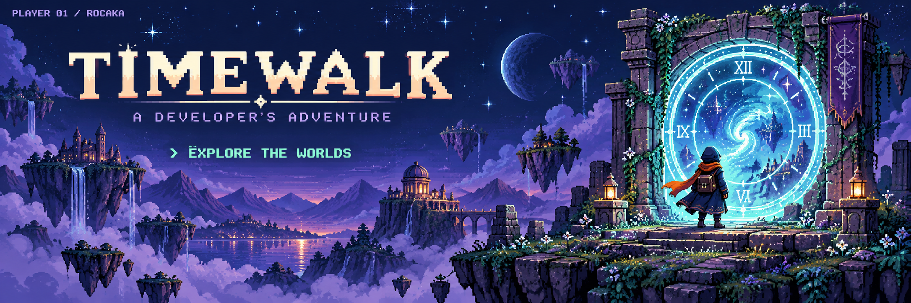
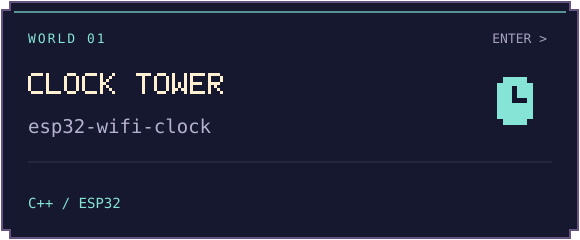
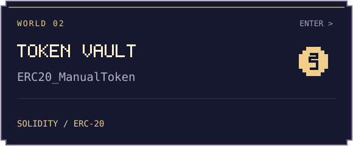
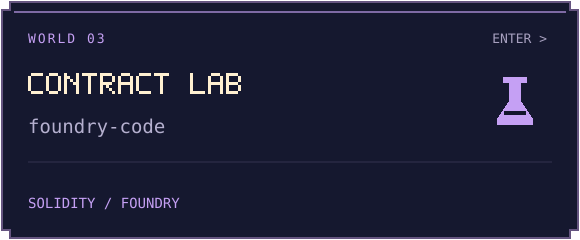
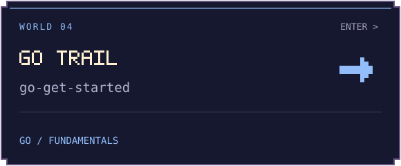

 

  <b>玩家 timewalk，欢迎来到我的代码世界。</b>  
  <samp>CLASS: CURIOUS BUILDER &nbsp; / &nbsp; EQUIPMENT: GO · SOLIDITY · ESP32</samp> 
  在代码与电路之间探索，把每一个小想法，写成下一段冒险。

 

<b>✦ &nbsp; SELECT YOUR WORLD &nbsp; ✦</b> 选择一个关卡，进入项目仓库

 

 

  <a href="https://github.com/rocaka?tab=repositories"><samp>[ ALL WORLDS ]</samp></a>
  &nbsp; &nbsp;
  <a href="https://github.com/rocaka?tab=stars"><samp>[ DISCOVERIES ]</samp></a>

