 


在 Web、后端、智能合约与嵌入式之间探索。这里收集我的代码练习、小工具，以及慢慢成形的想法。

[**项目仓库 ↗**](https://github.com/rocaka?tab=repositories) &nbsp; · &nbsp; [**我的收藏 ↗**](https://github.com/rocaka?tab=stars)

 

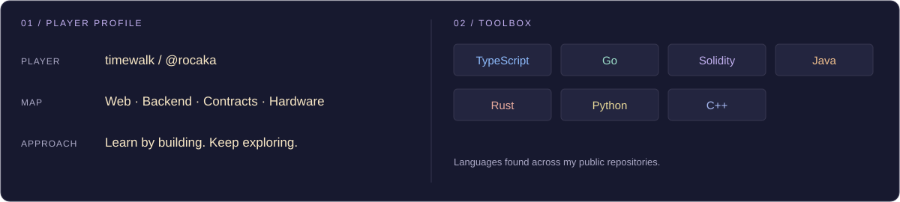

 


不同方向的小实验。点击卡片，查看代码。

<a href="https://github.com/rocaka/bluebook">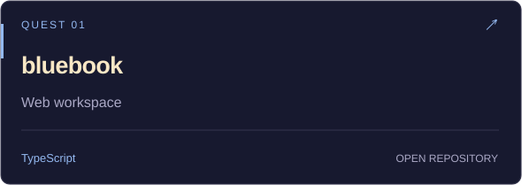</a>
<a href="https://github.com/rocaka/bluebookbackserver">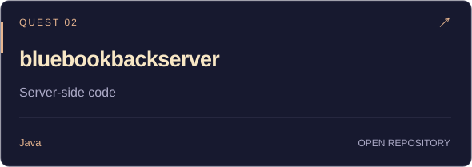</a>
 
<a href="https://github.com/rocaka/esp32-wifi-clock">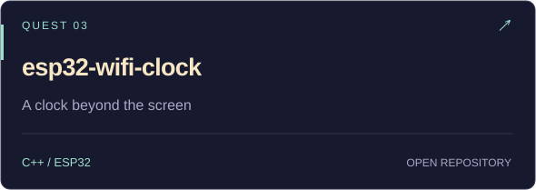</a>
<a href="https://github.com/rocaka/ERC20_ManualToken">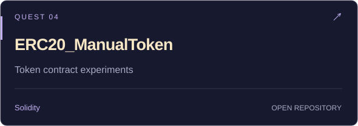</a>
 
<a href="https://github.com/rocaka/bulls_and_cows">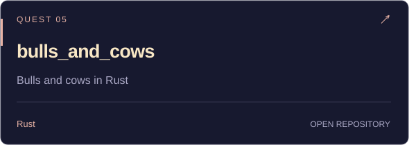</a>
<a href="https://github.com/rocaka/trainer">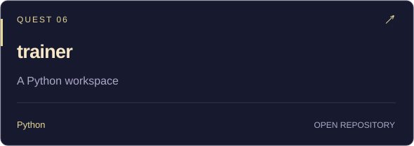</a>
 

 

| 路线 | 仓库入口 |
| :--- | :--- |
| **Go 路线** | [projectX](https://github.com/rocaka/projectX) · [go-get-started](https://github.com/rocaka/go-get-started) |
| **Web 路线** | [nextjs-dashboard](https://github.com/rocaka/nextjs-dashboard) · [trackplayer](https://github.com/rocaka/trackplayer) |
| **合约路线** | [foundry-code](https://github.com/rocaka/foundry-code) · [web3-ts-coffee](https://github.com/rocaka/web3-ts-coffee) |
| **C++ 路线** | [Cppgrammar](https://github.com/rocaka/Cppgrammar) |

 



GitHub 公开数据快照 · 2026-10-02 · 语言图按非 Fork 仓库主语言计数，不代表代码占比或熟练程度。

 
 

<samp>✦ &nbsp; SAVE YOUR PROGRESS. STAY CURIOUS. &nbsp; ✦</samp> 每一次提交，都是新的存档点。

